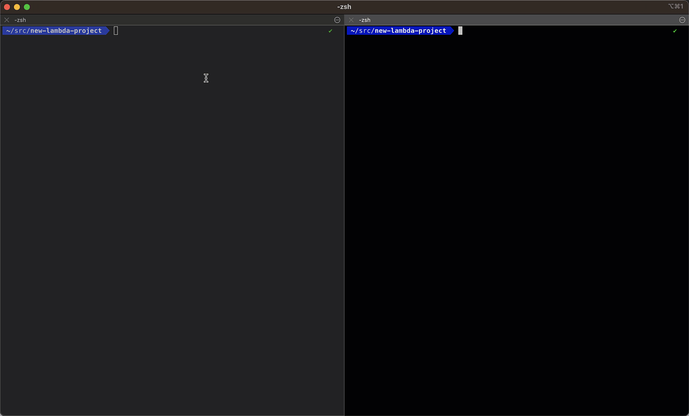
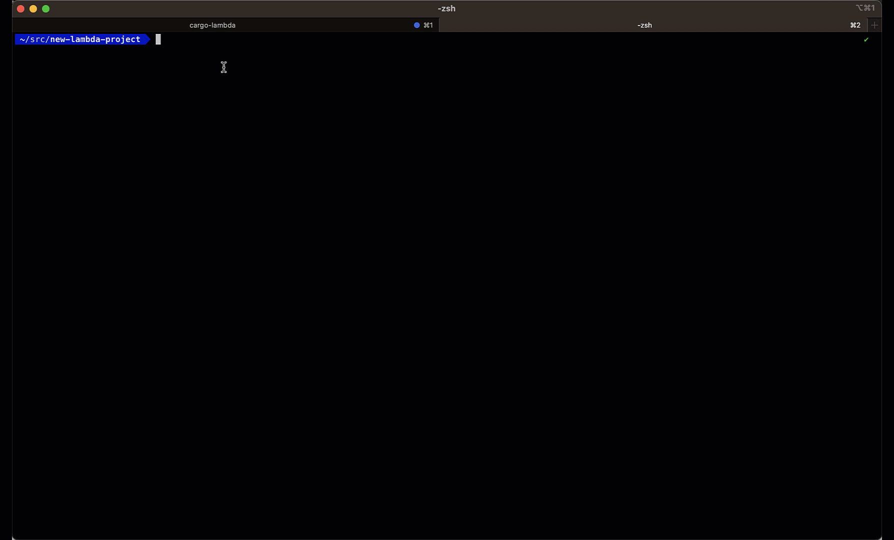

<div align="center">
    <h1>Build and deploy a serverless API with Rust and AWS Lambda</h1>
</div>

In this project you will learn how to build a REST API in Rust and deploy it to AWS Lambda.

No more.
No less.

<div align="center">
    
</div>


### Table of contents
1. [Why Rust and AWS Lambda are the perfect match?](#why-rust-and-aws-lambda-are-the-perfect-match)
2. [Our dataset](#our-dataset)
3. [The tools we will use](#the-tools-we-will-use)
4. [Bootstrapping the project](#bootstrapping-the-project)
5. [Developing the API](#developing-the-api)
6. [Running the API locally](#running-the-api-locally)
7. [Testing the API](#testing-the-api)
8. [Building the API binary](#building-the-api-binary)
9. [Deploying the API to AWS Lambda](#deploying-the-api-to-aws-lambda)
10. [Invoking the API](#invoking-the-api)
11. [Wanna build Real World ML systems with me?](#wanna-build-real-world-ml-systems-with-me)


## Why Rust and AWS Lambda are the perfect match?

[Rust](https://www.rust-lang.org/) is a systems programming language that is fast, safe, and easy to use.

I won't lie to you. It is harder to learn than Python or JavaScript.
But once you get the hang of it, you will be able to build
- fast,
- safe,
- and efficient software.

And dividends will start to flow. Both in terms of time and money. And don't forget, energy efficiency. Because Rust is greener than Python.

[AWS Lambda](https://aws.amazon.com/lambda/) is a serverless platform that allows you to run your code without having to worry about the underlying infrastructure.

- It is a pay-as-you-go service, so you only pay for what you use.
- It is super popular among companies, especially in startups that want to build systems that can scale from 0 to 100x in a cost-efficient way, and quickly.
- This is the platform I have met over and over again working with startups, so I thought, "yes, let's use it".


Rust and AWS Lambda are the perfect match, because when you write your code in Rust, your program execution
time is super fast, which means your cloud bills will be super low.

And this is what we want, right?


## Our dataset

The dataset we will use for this example consists of historical taxi trip data from NYC taxis between 2017 and 2024. You can find the raw data
on [this public website](https://www.nyc.gov/site/tlc/about/tlc-trip-record-data.page).

> 💡 This is the kind of data that data engieeners at companies like Uber work with.

Every record in our dataset correponds to one taxi trip
```json
{
    // info available when the trip starts
    "tpep_pickup_datetime": "2024-01-30T01:17:07Z",
    "PUlocationID": 123,    // starting location id
    "DOlocationID": 456,    // ending location id

    // info available when the trip is completed
    "tpep_dropoff_datetime":"2024-01-30T01:24:06Z",
    "trip_distance":1.06,
    "fare_amount":11.58
}
```
This type of data can be used to solve many real world business problems like:

* Taxi trip duration prediction → as Uber does every time you request a aride.
* Taxi demand prediction for efficient taxi driver allocation → as DoorDash to optimize their fleet of delivery.
* ... you name it!


> **Wanna to solve a real world business problem with this data?**
>
> In the Real-World ML Tutorial you will learn to build, step by step, an ML system that predicts taxi demand in each area of NYC hour by hour.
>
> With this hands-on tutorial you will make the leap from ML model prototypes inside Jupyter notebooks to end-2-end ML systems, that generates live predictions that can be used to make business decisions.
>
> 👉 **[Click here to learn more](https://realworldmachinelearning.carrd.co/)**

Now, let's get back to our API!

## The tools we will use

We will need to install a few tools to get started:

- [The Rust compiler and Cargo package manager](https://www.rust-lang.org/tools/install) to package and compile your code.

- [Rust analyzer](https://marketplace.visualstudio.com/items?itemName=rust-lang.rust-analyzer) to get syntax highlighting and error checking in your editor

- [Cargo lambda](https://www.cargo-lambda.info/guide/getting-started.html) to build and deploy your Lambda functions

- [AWS CLI](https://aws.amazon.com/cli/) to deploy your Lambda functions to AWS.


## Bootstrapping the project

You can start a new Rust AWS Lambda project with the following command:

```bash
cargo lambda new rust-lambda-api --http
```

> We add the `--http` flag to create a Lambda function that can be invoked via HTTP, so you can
> run it behind an API Gateway and expose it to the rest of services of your company's infrastructure.

With this command, Cargo Lambda will create a new Rust project with a basic structure.
```
├── Cargo.toml
├── src
│ ├── http_handler.rs
│ └── main.rs
└── README.md
```

* The [Cargo.toml](./Cargo.toml) file is the equivalent of the pyproject.toml file in Python. It contains the dependencies and metadata of our project.
* The [src/main.rs](./src/main.rs) file is the entry point of our lambda function. No need to edit it.
* The [src/http_handler.rs](./src/http_handler.rs) file contains the logic of our API. This is the file we will start editing 👨🏻‍💻

## Developing the API

Our lambda function does (like any other lambda function) 3 things:

1. Reads and parses the input parameters from the client request. In our case, the input parameters are
    - `from_ms`: The start date of the trip in milliseconds since the Unix epoch.
    - `n_results`: The maximum number of results to return in the response.

2. Does something from these parameters. In our case, it fetches the data from the NYC taxi dataset for the given time period.

3. Returns the result back to the client. In our case, it returns the collection of taxi trips as a JSON.

This is precisely what I have implemented in the [`src/http_handler.rs`](./src/http_handler.rs) file.

The meat of this function is actually done in the [`src/lib.rs`](./src/lib.rs) file, by the `get_trips` function.

```rust
// lib.rs

// public because we want to use it in the http_handler.rs file
// async to do non-blocking I/O operations, like downloading
// files from the internet, so we can handle many concurrent requests
// anyhow::Result to handle errors
// without having to define a custom error type every time.
pub async fn get_trips(
    from_ms: i64,
    n_results: i64,
    fake_data: Option<bool>,
) -> anyhow::Result<Vec<Trip>> {
    if fake_data.unwrap_or(false) {
        // if fake_data is true, we return a list of fake trips
        // we await because get_fake_trips is an async
        // function. This means it retuns a Future type, that
        // await unpacks.
        return get_fake_trips(from_ms, n_results).await;
    }

    // extract the year and month from the from_ms timestamp
    // no big deal
    let (year, month) = get_year_and_month(from_ms);
    info!("Extracted year: {}, month: {}", year, month);

    // Downloads the parquet file from the NYC taxi website
    info!(
        "Downloading parquet file for year: {}, month: {}",
        year, month
    );
    let file_path = download_parquet_file(year, month).await?;

    // Load parquet file with Polars, filter by the given time period and return the trips
    let trips = get_trips_from_file(&file_path, from_ms, n_results)?;

    info!("Returning {} trips", trips.len());

    // return the trips as a Result type with the Ok variant
    Ok(trips)
}
```

### Take a deep breath 🧘

Don't worry if you don't understand all the details of the code. The first time you see it, it is normal to feel a bit overwhelmed.

I added a few comments to the code to help you understand it. I also recommend you read these previous 3 articles I wrote about Rust.

* [Let's build a REST API in Rust, part 1](https://www.realworldml.net/blog/let-s-build-a-rest-api-in-rust)
* [Let's build a REST API in Rust, part 2](https://www.realworldml.net/blog/let-s-rust)
* [Let's build a REST API in Rust, part 3](https://www.realworldml.net/blog/let-s-build-a-rest-api-in-rust-part-3)


## Running the API locally
You can start the API locally with the following command:

```bash
cargo lambda watch
```

This commands starts a local server that you can invoke with your browser or with the following curl command:

```bash
curl "http://localhost:9000/get_trips?from_ms=1719849600000&n_results=100"
```



## Testing the API

Before deploying the API to AWS Lambda, we need to make sure it works as expected.

This is super important when you release new versions of your code to production, and you want to make sure it works as expected.

In the `src/http_handler.rs` file, you will find a `#[cfg(test)]` block with one unit test, that sends a sample request to the API and checks if the API returns a 200 OK response.

```rust
#[cfg(test)]
mod tests {
    use super::*;
    use lambda_http::{Request, RequestExt};
    use std::collections::HashMap;

    #[tokio::test]
    async fn test_success_response() {
        let mut query_string_parameters: HashMap<String, String> = HashMap::new();
        query_string_parameters.insert("from_ms".into(), "1719783621000".into());
        query_string_parameters.insert("n_results".into(), "50".into());

        let request = Request::default().with_query_string_parameters(query_string_parameters);

        let response = function_handler(request).await.unwrap();

        // Check that the response is 200 OK
        assert_eq!(response.status(), 200);
    }
}
```

You can run the test with

```bash
cargo test
```


## Building the API binary
Before deploying the API to AWS Lambda, we need to build the lambda function. Remember that Rust is a compiled language, so we need to compile the code before deploying it.

We can do this with the following command:

```bash
cargo lambda build --release --arm64
```

This will create a `bootstrap` binary in the `target/lambda/lambda-rust-api` directory.
```
├── src
│ ├── http_handler.rs
│ └── main.rs
└── target
  └── lambda
    └── lambda-rust-api
        └── bootstrap
```

## Deploying the API to AWS Lambda
To deploy to AWS Lambda you will need an AWS account with a user that has the necessary permissions to deploy to AWS Lambda.

From the AWS console IAM page, generate a new access key for your user.

Save the access key id and secret access key in your `.aws/credentials` file.

```toml
[NAME_OF_YOUR_AWS_PROFILE]
aws_access_key_id = YOUR_KEY_ID
aws_secret_access_key = YOUR_SECRET_KEY
```

You can now deploy the API to AWS Lambda with the following command:

```bash
cargo lambda deploy lambda-rust-api \
    --timeout 10 \
    --memory-size 1024 \
    --env-var RUST_LOG=info \
    --profile YOUR_AWS_PROFILE_NAME # Use the one in your ~/.aws/credentials that corresponds to your AWS user
```




## Invoking the API
You can invoke the API with the following command:

```bash
cargo lambda invoke lambda-rust-api \
    --data-file ./sample_request.json \
    --remote # meaning, we are invoking the API running on AWS remotely, not the local one
```

The `sample_request.json` file contains a sample request compatible with AWS API Gateway.
You can find it, as well as other samples in [this repository](https://github.com/calavera/aws-lambda-events/tree/main/src/fixtures).


Super fast.
Super cheap.
Super Rust.


## Wanna build Real World ML systems with me?

This is what companies need to build to scale their business.

And this is what you learn with my courses.

Wanna know more?
[Click here to know more](https://www.realworldml.net/courses)